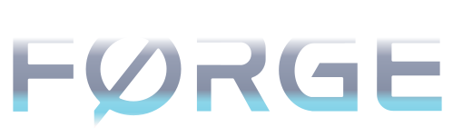

<p align="center">
  
</p>

# Forge

Science-backed AI team assembly. From goal to agents to artifacts.

[](LICENSE)
[](CONTRIBUTING.md)

Forge is an open-source system that uses controlled multi-agent scaling research (Kim et al., Google Research/MIT), persona science, and context engineering to assemble AI agent teams. It takes a goal, determines whether you need one agent or a team, selects the right coordination topology, and produces structured agent definitions with expert vocabulary, clear deliverables, and anti-pattern guardrails. Works with Claude Code.

## The Core Insight

The single highest-leverage intervention for generative **quality** is **vocabulary routing** — precise domain terminology that steers output toward expert register, bounded by a mid-range specificity optimum (too generic and too jargon-heavy both underperform). Real-world job titles and role structures define scope, register, and decision boundaries for each agent — they don't grant capability the model doesn't already have. The strongest-evidenced finding in Forge's research base is the opposite of "more agents is better": a Google Research/MIT-led scaling study (Kim et al.) found that once single-agent performance already exceeds ~45% accuracy on a task, adding agents produces *negative* returns. Forge's answer is the cascade — always try a single agent first — and teams of 3-4 (5 max) with structured artifact handoffs when a team is genuinely warranted.

## Quick Start: Claude Code

```
# Install as a plugin (recommended):
/plugin add https://github.com/jdforsythe/forge

# Or via Vercel's cross-agent installer:
npx add-skill jdforsythe/forge

# Then just describe what you want:
"Build me a SaaS analytics product"  # Mission Planner activates
"Create an agent for code review"     # Agent Creator activates
```

## What's Included

```
forge/
├── .claude-plugin/      Plugin metadata
│   ├── marketplace.json     Marketplace definition
│   └── plugin.json          Plugin manifest
│
├── skills/              4 core skills
│   ├── mission-planner/     Decomposes goals into team blueprints
│   ├── agent-creator/       Builds individual agent definitions
│   ├── skill-creator/       Creates reusable skill packages
│   └── librarian/           Manages the agent/template library
│
├── agents/              3 infrastructure agents
│   ├── verifier.md          Validates outputs against schemas
│   ├── researcher.md        Gathers context and source material
│   └── reviewer.md          Reviews and critiques agent definitions
│
├── library/             Starter collection
│   └── index.json           11 domain agents, 3 team templates
│       ├── software/        Product Manager, Architect, Lead Engineer, QA
│       ├── marketing/       Campaign Strategist, Content Creator, Designer, Analytics Lead
│       └── security/        Lead Auditor, Penetration Tester, Compliance Analyst
│
├── schemas/             Format specifications
│   ├── agent-definition.md      7-component agent structure
│   ├── team-blueprint.md        Blueprint format for coordinated teams
│   ├── index-schema.json        Library index format
│   └── usage-log-schema.json    Usage tracking format
│
├── docs/                User documentation
│   └── research/            Scientific foundation (8 reference documents)
└── ...
```

## How It Works

Forge uses a 3-level decision flow:

**Level 0 — Single Agent.** The goal is simple enough for one agent. Forge produces a single well-prompted agent definition with the right vocabulary, deliverables, and guardrails. No coordination overhead.

**Level 1 — Known Pattern.** The goal matches a template in the library (e.g., SaaS product, marketing campaign, security audit). Forge loads the template, adapts roles to your specific goal, and creates the full agent team with artifact handoff chains.

**Level 2 — Novel Domain.** No template exists. Forge decomposes the goal into workstreams, proposes a team topology (pipeline, parallel, coordinator, or hierarchical), defines roles with precise vocabulary, and iterates with you until the blueprint is right.

At every level, the same principles apply: real-world role titles, domain-specific vocabulary, structured artifacts between agents, and teams of 3-4 agents recommended (5 hard cap).

## Research Foundation

Every design decision in Forge traces back to published research. The `docs/research/` directory contains synthesized findings from a Google Research/MIT-led multi-agent scaling study (Kim et al., 2025), persona science on role/persona effects (including PRISM, Hu et al. 2026), the MAST multi-agent failure taxonomy (Cemri et al., 2025), and context engineering best practices. Evidence base verified July 2026; see [docs/research/source-index.md](docs/research/source-index.md) for the full bibliography.

For the full methodology, see [METHODOLOGY.md](METHODOLOGY.md).

## Known Issues

- **Cowork compatibility**: Forge skills fail to run in Cowork. Skills load but stop executing when they attempt to read reference files outside the plugin directory. We are looking for help solving this — PRs welcome! See [CONTRIBUTING.md](CONTRIBUTING.md) if you want to take a crack at it.

## Contributing

See [CONTRIBUTING.md](CONTRIBUTING.md) for guidelines on adding agents, templates, skills, and research.

## License

[MIT](LICENSE)
